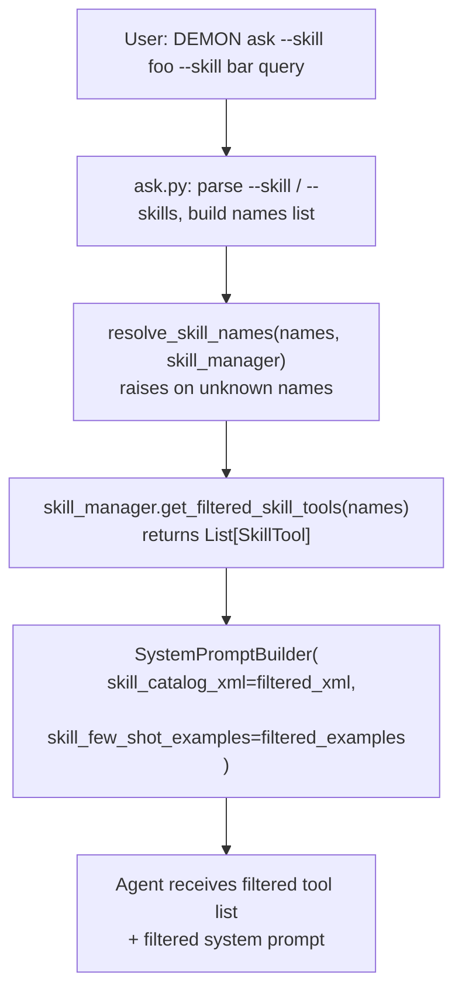
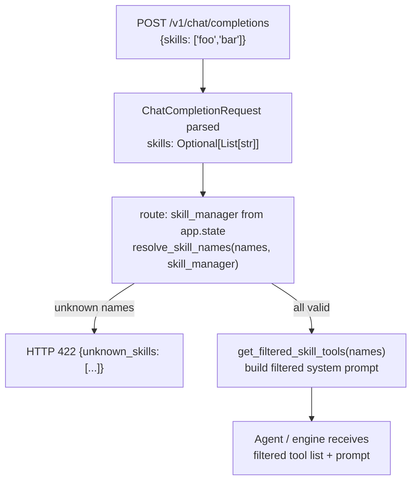
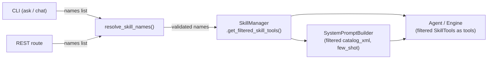

# Design Document: Specific Skill Selection

## Overview

This feature adds explicit skill selection to OpenDemon's CLI, REST API, and WebSocket API. Today, `SkillManager` loads every discovered skill into the agent unconditionally. After this change, callers can name one or more skills and the system will restrict the agent's `Active_Skill_Set` to exactly those skills — scoping both the tool list and the system prompt's `## Available Skills` catalog.

The change touches four layers:

| Layer | Change |
|---|---|
| `SkillManager` | New `get_filtered_skill_tools(names)` method |
| Shared validation | `resolve_skill_names()` helper (CLI + API) |
| CLI (`ask`, `chat`) | `--skill` (repeatable) and `--skills` (comma-separated) options |
| REST / WebSocket API | Optional `skills` field on `ChatCompletionRequest`; route-level validation |

`SystemPromptBuilder` requires **no changes** — it already accepts skill data as constructor arguments. Callers simply pass the filtered data instead of the full catalog.

---

## Architecture

### Data Flow — CLI Path



### Data Flow — REST API Path



### Component Interaction Overview



---

## Components and Interfaces

### 1. `SkillManager.get_filtered_skill_tools()` (new method)

Location: `src/OpenDEMON/skills/manager.py`

```python
def get_filtered_skill_tools(
    self,
    names: List[str],
    *,
    tool_executor: Optional[ToolExecutor] = None,
) -> List[BaseTool]:
    """Return SkillTool instances for the named skills only.

    Parameters
    ----------
    names:
        Skill names to include. Duplicates are deduplicated; order is
        preserved (first occurrence wins).
    tool_executor:
        Optional executor override; falls back to self._tool_executor.

    Returns
    -------
    List[BaseTool]
        One SkillTool per unique name in ``names``.

    Raises
    ------
    KeyError
        If any name in ``names`` is not present in the Skill_Catalog.
        The exception message identifies the missing name.
    """
```

Implementation notes:
- Deduplicate `names` preserving insertion order (use `dict.fromkeys`).
- Iterate over deduplicated names; call `self.resolve(name)` for each — this already raises `KeyError` for missing names.
- Construct `SkillTool` objects identically to `get_skill_tools()` (same executor/resolver wiring, same overlay application).
- Overlays are already applied during `discover()` to `self._skills`; since `resolve()` returns from `self._skills`, filtered tools inherit overlays automatically.
- Dependency validation runs once during `discover()` against the full catalog — the design intentionally does **not** re-run it on a subset, to avoid spurious errors when a dependency skill is in the catalog but not in the selected subset.
- Empty list input → return `[]` without error (not a `KeyError`).

### 2. `resolve_skill_names()` — shared validation helper

Location: `src/OpenDEMON/skills/validation.py` (new file)

```python
def resolve_skill_names(
    names: List[str],
    skill_manager: SkillManager,
    *,
    catalog_is_empty: bool = False,
) -> List[str]:
    """Validate a list of skill names against the Skill_Catalog.

    Returns the deduplicated, validated names on success.

    Raises
    ------
    UnknownSkillsError
        If any names are not in the Skill_Catalog, carrying the list of
        all unknown names and a flag indicating whether the catalog is empty.
    """

class UnknownSkillsError(ValueError):
    """Raised when one or more skill names cannot be resolved.

    Attributes
    ----------
    unknown_names : List[str]
        All names that were not found.
    catalog_empty : bool
        True when no skills are installed at all (affects error message).
    """
    def __init__(self, unknown_names: List[str], *, catalog_empty: bool = False) -> None:
        self.unknown_names = unknown_names
        self.catalog_empty = catalog_empty
        super().__init__(str(self))

    def __str__(self) -> str:
        lines = [
            f"Unknown skill: '{n}'. Run 'DEMON skill list' to see installed skills."
            for n in self.unknown_names
        ]
        if self.catalog_empty:
            lines.append(
                "No skills are installed. Run 'DEMON skill install' to add skills."
            )
        return "\n".join(lines)
```

This helper is imported by both CLI command modules and the API route handler, preventing logic duplication.

### 3. CLI — `ask.py` changes

New Click options added to the `ask` command:

```python
@click.option(
    "--skill",
    "skill_names",
    multiple=True,
    help="Skill name to enable (repeatable). e.g. --skill cuopt-install",
)
@click.option(
    "--skills",
    "skills_shorthand",
    default=None,
    help="Comma-separated skill names (shorthand). e.g. --skills 'cuopt-install,aiq-deploy'",
)
```

The function signature gains `skill_names: tuple[str, ...]` and `skills_shorthand: str | None`.

**Merge + deduplication logic** (runs before agent construction):

```python
# Merge --skill (repeatable) and --skills (comma-separated shorthand)
combined: list[str] = list(skill_names)
if skills_shorthand and skills_shorthand.strip():
    for part in skills_shorthand.split(","):
        trimmed = part.strip()
        if trimmed:
            combined.append(trimmed)

# Deduplicate preserving order
active_skill_names: list[str] | None = None
if combined:
    active_skill_names = list(dict.fromkeys(combined))
```

**Validation and tool selection** (after `SkillManager.discover()`):

```python
if active_skill_names is not None:
    from OpenDEMON.skills.validation import UnknownSkillsError, resolve_skill_names
    try:
        active_skill_names = resolve_skill_names(
            active_skill_names,
            skill_manager,
            catalog_is_empty=len(skill_manager.skill_names()) == 0,
        )
    except UnknownSkillsError as exc:
        console.print(f"[red]{exc}[/red]")
        sys.exit(1)
    # Print active skill set to stderr before first query
    console.print(
        "[dim]Active skills: " + ", ".join(active_skill_names) + "[/dim]"
    )
    skill_tools = skill_manager.get_filtered_skill_tools(active_skill_names)
    skill_catalog_xml = _build_catalog_xml_for_subset(skill_manager, active_skill_names)
    skill_few_shot = _build_few_shot_for_subset(skill_manager, active_skill_names)
else:
    # Default: full catalog
    skill_tools = skill_manager.get_skill_tools()
    skill_catalog_xml = skill_manager.get_catalog_xml()
    skill_few_shot = skill_manager.get_few_shot_examples()
```

The filtered `skill_catalog_xml` and `skill_few_shot` are forwarded to `SystemPromptBuilder` and the agent's tool list respectively.

### 4. CLI — `chat_cmd.py` changes

Identical `--skill` / `--skills` options added to the `chat` command. The same merge, dedup, and validation logic applies. The filtered data is passed into the `SystemPromptBuilder` and agent `kwargs["tools"]` within the existing agent-wiring block.

### 5. `ChatCompletionRequest` model change

Location: `src/OpenDEMON/server/models.py`

```python
class ChatCompletionRequest(BaseModel):
    model: str
    messages: List[ChatMessage]
    temperature: float = 0.7
    max_tokens: int = 1024
    stream: bool = False
    tools: Optional[List[Dict[str, Any]]] = None
    skills: Optional[List[str]] = None   # ← new field
```

`skills` is optional (`None` = default behavior: full catalog). An empty list `[]` is treated identically to `None` (load full catalog).

### 6. REST route handler change

Location: `src/OpenDEMON/server/routes.py`

At the start of `chat_completions()`, after existing memory/complexity logic:

```python
# --- Skill selection ---------------------------------------------------
skill_manager = getattr(request.app.state, "skill_manager", None)
active_skill_tools: Optional[List] = None
active_catalog_xml: Optional[str] = None
active_few_shot: Optional[List[str]] = None

if skill_manager is not None and request_body.skills:
    requested = [s for s in request_body.skills if s]  # drop empty strings
    if requested:
        from OpenDEMON.skills.validation import UnknownSkillsError, resolve_skill_names
        try:
            validated = resolve_skill_names(
                requested,
                skill_manager,
                catalog_is_empty=len(skill_manager.skill_names()) == 0,
            )
        except UnknownSkillsError as exc:
            detail = {"unknown_skills": exc.unknown_names}
            if exc.catalog_empty:
                detail["detail"] = "No skills are installed."
            raise HTTPException(status_code=422, detail=detail)

        active_skill_tools = skill_manager.get_filtered_skill_tools(validated)
        active_catalog_xml = _build_catalog_xml_for_subset(skill_manager, validated)
        active_few_shot = _build_few_shot_for_subset(skill_manager, validated)
```

`active_skill_tools`, `active_catalog_xml`, and `active_few_shot` are then threaded into the agent/direct call paths in place of the global skill state for that request only. The global `skill_manager._skills` is **never mutated**.

### 7. WebSocket endpoint change

The current `ws_bridge.py` exposes an **agent events** channel (`/v1/agents/events`), not a full chat endpoint. The requirements reference a WebSocket *chat* endpoint that accepts a `"skills"` key. This endpoint does not currently exist as a separate file.

Based on the requirements, the intent is that wherever a WebSocket chat handler fires an agent run (or if one is added), it reads a `"skills"` key from the incoming JSON message, validates it with `resolve_skill_names()`, and applies `get_filtered_skill_tools()` before dispatching. The error response sends:

```json
{
  "type": "error",
  "unknown_skills": ["bad-skill"],
  "detail": "..."
}
```

If a dedicated WS chat endpoint is added in the future, it follows the same pattern as the REST route handler above.

### 8. Helper functions for filtered catalog/few-shot

Two private helpers are added to `ask.py`, `chat_cmd.py`, and `routes.py` (or extracted to a shared utility module):

```python
def _build_catalog_xml_for_subset(
    skill_manager: SkillManager, names: List[str]
) -> str:
    """Build <available_skills> XML containing only the named skills."""
    import html
    lines = ["<available_skills>"]
    for name in names:
        manifest = skill_manager.resolve(name)
        if manifest.disable_model_invocation:
            continue
        lines.append(
            f"  <skill name={html.escape(name)!r}"
            f" description={html.escape(manifest.description or name)!r} />"
        )
    lines.append("</available_skills>")
    return "\n".join(lines)


def _build_few_shot_for_subset(
    skill_manager: SkillManager, names: List[str]
) -> List[str]:
    """Return few-shot examples only for the named skills."""
    examples: List[str] = []
    for name in names:
        manifest = skill_manager.resolve(name)
        oj = manifest.metadata.get("DEMON", {}) if manifest.metadata else {}
        for ex in oj.get("few_shot", []) or []:
            if not isinstance(ex, dict):
                continue
            inp = str(ex.get("input", ""))
            out = str(ex.get("output", ""))
            if inp or out:
                examples.append(f"### {name}\nInput: {inp}\nOutput: {out}")
    return examples
```

These mirror the logic inside `SkillManager.get_catalog_xml()` and `get_few_shot_examples()` but operate on a subset. To avoid duplication in the long run, these could be extracted to a `SkillManager.get_filtered_catalog_xml(names)` and `get_filtered_few_shot(names)` pair — the design treats this as an optional follow-up refactor.

---

## Data Models

### `UnknownSkillsError` (new)

```python
@dataclass
class UnknownSkillsError(ValueError):
    unknown_names: List[str]  # all unresolved names
    catalog_empty: bool = False
```

### `ChatCompletionRequest` update

```python
skills: Optional[List[str]] = None
# None  → use full catalog (default)
# []    → use full catalog (treated as absent)
# [..] → filter catalog to these names; 422 on any unknown
```

### Active_Skill_Set (runtime, not persisted)

The `Active_Skill_Set` is a transient list of `SkillTool` objects scoped to a single invocation. It is never stored in `SkillManager._skills` or any database. The global catalog is always left intact.

---

## Correctness Properties

*A property is a characteristic or behavior that should hold true across all valid executions of a system — essentially, a formal statement about what the system should do. Properties serve as the bridge between human-readable specifications and machine-verifiable correctness guarantees.*

### Property 1: Filtered tools exactly match the requested names

*For any* registered `SkillManager` with a non-empty catalog and any non-empty subset of skill names drawn from that catalog, calling `get_filtered_skill_tools(subset)` returns a list whose `spec.name` values (stripping the `"skill_"` prefix) are exactly the deduplicated names in `subset` — no extras, no omissions.

**Validates: Requirements 1.2, 2.2, 3.1, 3.6**

### Property 2: Unknown name always raises KeyError

*For any* `SkillManager` catalog and any name that is NOT in that catalog, calling `get_filtered_skill_tools([name])` raises `KeyError`, and the exception message identifies the missing name.

**Validates: Requirements 1.3, 2.3, 3.2, 6.1, 6.3**

### Property 3: All unknown names are reported together

*For any* list of requested skill names that contains one or more names absent from the `SkillManager` catalog, the `UnknownSkillsError` raised by `resolve_skill_names()` contains **all** of the missing names in its `unknown_names` list — not just the first one found.

**Validates: Requirements 1.3, 2.3, 4.3, 6.3**

### Property 4: Overlay metadata is preserved in filtered results

*For any* skill in the `SkillManager` catalog that has an optimization overlay applied, if that skill's name is included in a `get_filtered_skill_tools(names)` call, the returned `SkillTool`'s `spec.description` equals the overlaid description (not the original manifest description).

**Validates: Requirements 3.5**

### Property 5: Deduplication — each skill tool appears at most once

*For any* list of skill names (possibly with duplicates) passed to `get_filtered_skill_tools()`, the length of the returned list equals the count of unique names in the input (assuming all names exist in the catalog).

**Validates: Requirements 1.2, 2.2, 3.6, 7.2**

### Property 6: Merge and deduplication of --skill and --skills

*For any* combination of values passed via `--skill` (repeatable) and `--skills` (comma-separated), the resulting `active_skill_names` list equals the deduplicated union of both sources, with each name appearing exactly once and whitespace trimmed.

**Validates: Requirements 7.2, 7.3**

### Property 7: System prompt contains exactly the active skill set

*For any* non-empty `Active_Skill_Set`, passing its `catalog_xml` to `SystemPromptBuilder` and calling `build()` produces a system prompt whose `## Available Skills` section contains exactly the names in the `Active_Skill_Set` — every selected skill appears and no non-selected skill appears.

**Validates: Requirements 5.1, 5.4**

### Property 8: API unknown-skill error reports all missing names

*For any* `POST /v1/chat/completions` request whose `skills` field contains one or more names not in the `SkillManager` catalog, the response is HTTP 422 and the `"unknown_skills"` list in the response body contains **every** requested name that was not found.

**Validates: Requirements 4.2, 4.3, 6.2, 6.3**

---

## Error Handling

### CLI errors

| Scenario | Behavior |
|---|---|
| One or more unknown skill names | Print all unknown names using `UnknownSkillsError.__str__()`, exit code 1 |
| Empty catalog + any skill name | Same message + install hint appended |
| `--skills ""` (empty string) | Treated as absent; load full catalog silently |
| Skills subsystem not enabled | `--skill` / `--skills` options still parse; if no `SkillManager` is available, print a warning and fall back to full-catalog behavior |

CLI error output goes to `stderr`. The banner line listing the `Active_Skill_Set` also goes to `stderr` (before the first prompt/response).

### API errors

| Scenario | HTTP status | Response body |
|---|---|---|
| Unknown skill name(s) | 422 | `{"unknown_skills": ["name1", ...]}` |
| Unknown + empty catalog | 422 | `{"unknown_skills": [...], "detail": "No skills are installed."}` |
| `skills: []` or `skills: null` | — | No error; full catalog used |
| `SkillManager` not on `app.state` | — | `skills` field silently ignored; request proceeds normally |

### `SkillManager` errors

`get_filtered_skill_tools()` raises `KeyError` immediately on the first unknown name it encounters during iteration. Callers (CLI and API route) should collect all names upfront using `resolve_skill_names()` — which collects *all* errors — before calling `get_filtered_skill_tools()`, so users see all problems at once.

---

## Testing Strategy

### Unit tests (example-based)

- `test_get_filtered_skill_tools_empty_list` — calling with `[]` returns `[]`
- `test_get_filtered_skill_tools_backward_compat` — calling `get_skill_tools()` still returns full catalog
- `test_cli_ask_no_skill_option` — omitting `--skill` loads full catalog (default behavior)
- `test_cli_ask_skills_shorthand_empty_string` — `--skills ""` is treated as absent
- `test_api_skills_null` — `skills: null` in request body uses full catalog
- `test_api_skills_empty_list` — `skills: []` uses full catalog
- `test_resolve_skill_names_empty_catalog_error` — empty catalog + any name → error with install note

### Property-based tests

The project uses Python. The recommended property-based testing library is **Hypothesis**.

Each property test is configured to run a minimum of 100 examples (`@settings(max_examples=100)`).

**Tag format**: `# Feature: specific-skill-selection, Property {N}: {property_text}`

---

#### Property 1 test — Filtered tools exactly match requested names

```python
# Feature: specific-skill-selection, Property 1: filtered tools exactly match the requested names
@settings(max_examples=100)
@given(
    catalog_names=st.lists(st.from_regex(r'[a-z][a-z0-9-]{0,30}', fullmatch=True), min_size=1, max_size=20, unique=True),
    subset_size=st.integers(min_value=1, max_value=20),
)
def test_property_filtered_tools_exact_match(catalog_names, subset_size):
    subset = catalog_names[:min(subset_size, len(catalog_names))]
    mgr = _build_manager(catalog_names)
    tools = mgr.get_filtered_skill_tools(subset)
    result_names = {t.spec.name.removeprefix("skill_") for t in tools}
    assert result_names == set(subset)
```

#### Property 2 test — Unknown name always raises KeyError

```python
# Feature: specific-skill-selection, Property 2: unknown name always raises KeyError
@settings(max_examples=100)
@given(
    catalog_names=st.lists(st.from_regex(r'[a-z][a-z0-9-]{0,30}', fullmatch=True), min_size=0, max_size=10, unique=True),
    unknown=st.from_regex(r'zzz-[a-z]{4,10}', fullmatch=True),
)
def test_property_unknown_name_raises_key_error(catalog_names, unknown):
    assume(unknown not in catalog_names)
    mgr = _build_manager(catalog_names)
    with pytest.raises(KeyError):
        mgr.get_filtered_skill_tools([unknown])
```

#### Property 3 test — All unknown names reported together

```python
# Feature: specific-skill-selection, Property 3: all unknown names are reported together
@settings(max_examples=100)
@given(
    catalog_names=st.lists(st.from_regex(r'[a-z][a-z0-9-]{0,20}', fullmatch=True), min_size=0, max_size=10, unique=True),
    unknown_names=st.lists(st.from_regex(r'zzz-[a-z]{4,10}', fullmatch=True), min_size=1, max_size=5, unique=True),
)
def test_property_all_unknown_names_reported(catalog_names, unknown_names):
    for u in unknown_names:
        assume(u not in catalog_names)
    mgr = _build_manager(catalog_names)
    with pytest.raises(UnknownSkillsError) as exc_info:
        resolve_skill_names(catalog_names + unknown_names, mgr)
    assert set(exc_info.value.unknown_names) == set(unknown_names)
```

#### Property 4 test — Overlay metadata preserved

```python
# Feature: specific-skill-selection, Property 4: overlay metadata is preserved in filtered results
@settings(max_examples=100)
@given(
    skill_name=st.from_regex(r'[a-z][a-z0-9-]{2,20}', fullmatch=True),
    overlay_desc=st.text(min_size=1, max_size=80, alphabet=st.characters(whitelist_categories=('L', 'N', 'Z'))),
)
def test_property_overlay_preserved_in_filtered_tool(skill_name, overlay_desc):
    mgr = _build_manager_with_overlay(skill_name, overlay_desc)
    tools = mgr.get_filtered_skill_tools([skill_name])
    assert tools[0].spec.description == overlay_desc
```

#### Property 5 test — Deduplication

```python
# Feature: specific-skill-selection, Property 5: each skill tool appears at most once
@settings(max_examples=100)
@given(
    catalog_names=st.lists(st.from_regex(r'[a-z][a-z0-9-]{0,20}', fullmatch=True), min_size=1, max_size=10, unique=True),
    repeat_count=st.integers(min_value=2, max_value=5),
)
def test_property_deduplication(catalog_names, repeat_count):
    duplicated = catalog_names * repeat_count
    mgr = _build_manager(catalog_names)
    tools = mgr.get_filtered_skill_tools(duplicated)
    assert len(tools) == len(catalog_names)
```

#### Property 6 test — CLI merge and deduplication

```python
# Feature: specific-skill-selection, Property 6: merge and deduplication of --skill and --skills
@settings(max_examples=100)
@given(
    skill_args=st.lists(st.from_regex(r'[a-z][a-z0-9-]{0,20}', fullmatch=True), min_size=0, max_size=5),
    skills_csv=st.lists(
        st.one_of(
            st.from_regex(r'[a-z][a-z0-9-]{0,20}', fullmatch=True),
            st.from_regex(r'\s+[a-z][a-z0-9-]{0,20}\s+', fullmatch=True),
        ),
        min_size=0, max_size=5
    ),
)
def test_property_cli_merge_deduplicate(skill_args, skills_csv):
    csv_string = ",".join(skills_csv)
    result = _merge_and_deduplicate(skill_args, csv_string)
    trimmed_csv = [s.strip() for s in skills_csv if s.strip()]
    expected = list(dict.fromkeys(list(skill_args) + trimmed_csv))
    assert result == expected
```

#### Property 7 test — System prompt contains exactly active skill set

```python
# Feature: specific-skill-selection, Property 7: system prompt contains exactly the active skill set
@settings(max_examples=100)
@given(
    catalog=st.lists(
        st.tuples(
            st.from_regex(r'[a-z][a-z0-9-]{2,15}', fullmatch=True),
            st.text(min_size=5, max_size=60),
        ),
        min_size=1, max_size=15, unique_by=lambda t: t[0]
    ),
    subset_size=st.integers(min_value=1, max_value=15),
)
def test_property_system_prompt_exact_skill_set(catalog, subset_size):
    subset = catalog[:min(subset_size, len(catalog))]
    subset_xml = _build_xml_from_tuples(subset)
    all_names = [name for name, _ in catalog]
    subset_names = [name for name, _ in subset]
    non_subset_names = [n for n in all_names if n not in subset_names]
    builder = SystemPromptBuilder(agent_template="", skill_catalog_xml=subset_xml)
    prompt = builder.build()
    for name in subset_names:
        assert name in prompt
    for name in non_subset_names:
        assert name not in prompt
```

#### Property 8 test — API error reports all missing names

```python
# Feature: specific-skill-selection, Property 8: API error reports all missing names
@settings(max_examples=100)
@given(
    catalog=st.lists(st.from_regex(r'[a-z][a-z0-9-]{2,20}', fullmatch=True), min_size=0, max_size=8, unique=True),
    unknown=st.lists(st.from_regex(r'zzz-[a-z]{4,10}', fullmatch=True), min_size=1, max_size=4, unique=True),
)
def test_property_api_reports_all_unknown_skills(client, catalog, unknown):
    for u in unknown:
        assume(u not in catalog)
    _setup_skill_manager(client.app, catalog)
    resp = client.post("/v1/chat/completions", json={
        "model": "test", "messages": [{"role": "user", "content": "hi"}],
        "skills": catalog + unknown,
    })
    assert resp.status_code == 422
    body = resp.json()
    assert set(body["unknown_skills"]) == set(unknown)
```

### Integration tests

- WebSocket skills validation: send a WS chat message with `"skills": ["unknown-skill"]`, assert error response shape with `"unknown_skills"` key.
- WebSocket skills filtering: send a WS chat message with valid `"skills"`, assert only those tools are visible to the agent.
- End-to-end: `DEMON ask --skill cuopt-install "what is cuOpt?"` hits a real (or stubbed) agent with only that skill available.

### Testing notes

- Property tests mock `SkillManager` using in-memory manifests (no disk I/O) so they run fast and are suitable for 100+ iterations.
- The `SystemPromptBuilder` property test operates on pure string generation — no engine required.
- API property tests use FastAPI's `TestClient` with a mock `app.state.skill_manager`.
